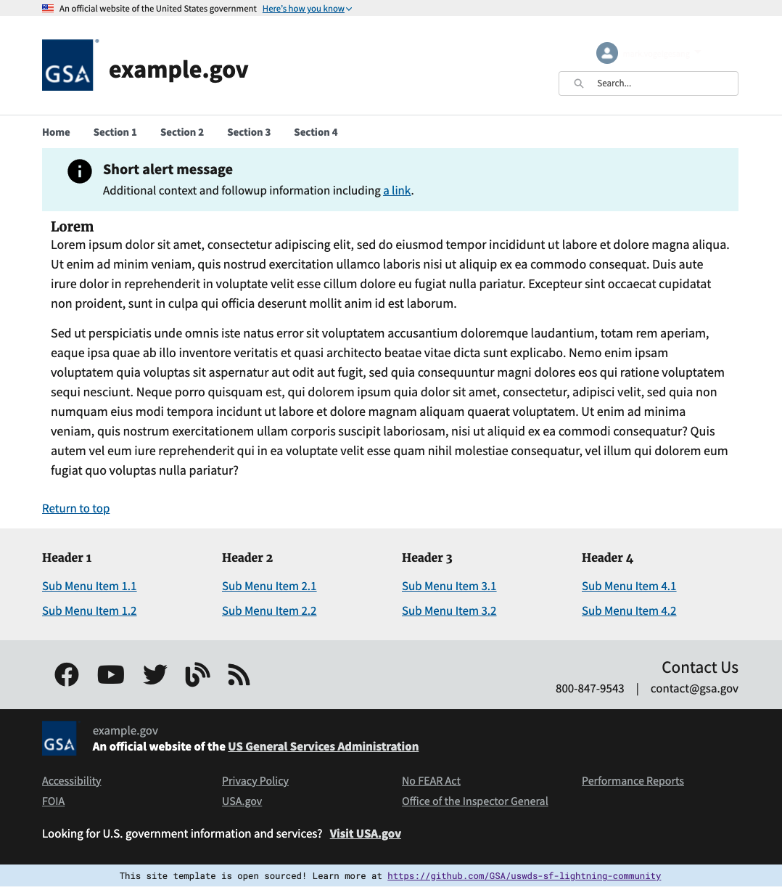

# US Web Design System Salesforce Lightning Community Theme

An implementation of the US Web Design System for Salesforce Lightning Communities.

## Installation Instructions

See [INSTALLATION](https://github.com/GSA/uswds-sf-lightning-community/blob/master/INSTALLATION.md)

## Accessibility

This template follows the US Web Design System markup as much as possible within the Salesforce interface. Where deviations from the original are required, Salesforce Lightning Design system is sought as a first alternative.
